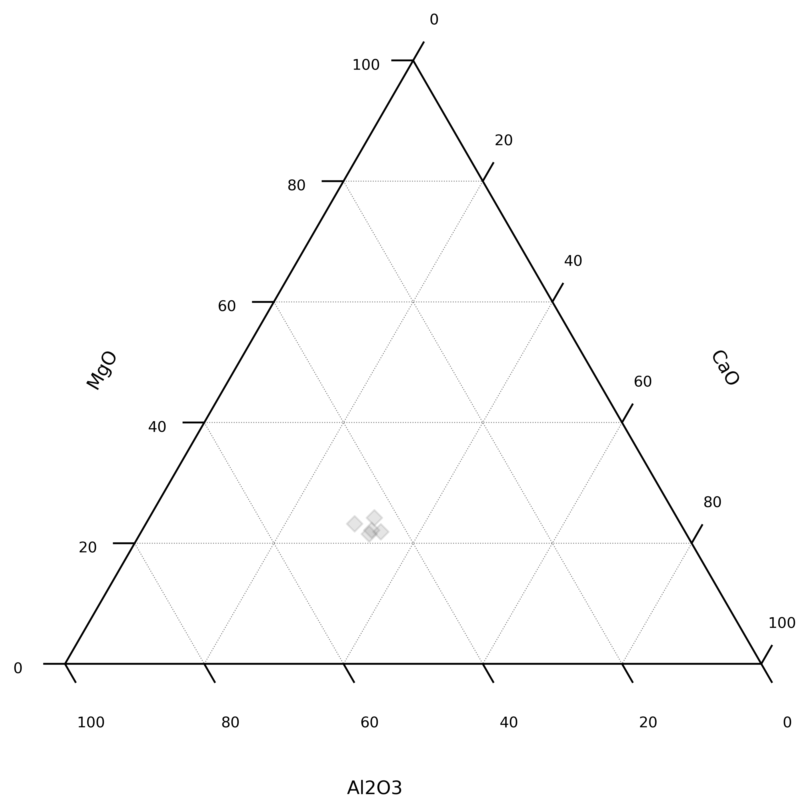
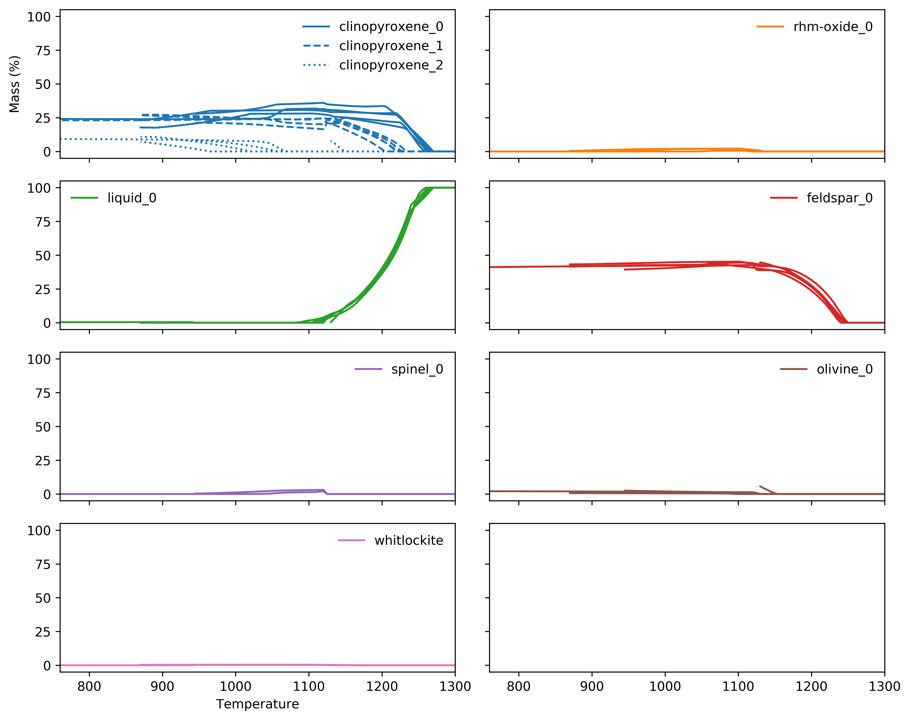

Uncertainties and alphaMELTS Experiments
===========================================

While alphaMELTS is a useful tool for formulating hypotheses around magmatic processes,
analytical uncertainties for compositional parameters are difficult to propagate. Here
I've given an example of taking the composition of average MORB, adding 'noise' to
represent multiple possible realisations under analytical uncertainties, and conducted
replicate alphaMELTS experiments to provide some quantification of the uncertainties in
the results. Note that the 'noise' added here is uncorrelated, and as such may usefully
represent analytical uncertainty. Geological uncertainties are typically strongly
correlated, and the uncertainties associated with e.g. variable mineral assemblages
should be modelled differently.

.. literalinclude:: montecarlo.py
  :language: python
  :end-before: # %% Data

First we create a :class:`~pandas.DataFrame` with our composition, which we then 'blur':

.. literalinclude:: montecarlo.py
  :language: python
  :start-after: # %% Data
  :end-before: # %% replicate

.. literalinclude:: montecarlo.py
  :language: python
  :start-after: # %% replicate
  :end-before: # %% setup an environment

Then we can configure an environment:

.. literalinclude:: montecarlo.py
  :language: python
  :start-after: # %% setup an environment
  :end-before: # %% compositional

This represents a relatively small variation in composition:

.. literalinclude:: montecarlo.py
  :language: python
  :start-after: # %% compositional variation
  :end-before: # %% save figure

Now we can conduct a MELTS run for each of these compositions:

.. literalinclude:: montecarlo.py
  :language: python
  :start-after: # %% run the models
  :end-before: # %% aggregate the results

And finally, we can visualise the results, and start to understand uncertainties in the
various parameters we extract from these models. Notably, even 'relatively small'
variations in composition can manifest as significant uncertainties in outputs:

.. literalinclude:: montecarlo.py
  :language: python
  :start-after: # %% aggregate the results
  :end-before: # %% save figure

.. seealso::

  Examples:
    `alphaMELTS Environment Configuration <environment.html>`__,
    `pyrolite-hosted alphaMELTS Installation <localinstall.html>`__,
    `Automating alphaMELTS Runs <automation.html>`__,
    `Handling Outputs from Melts: Tables <tables.html>`__
