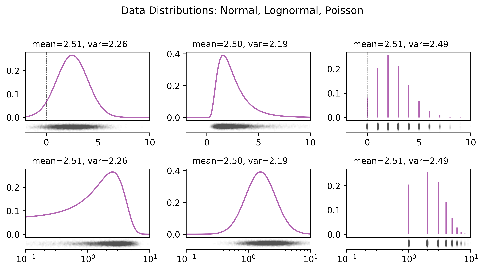
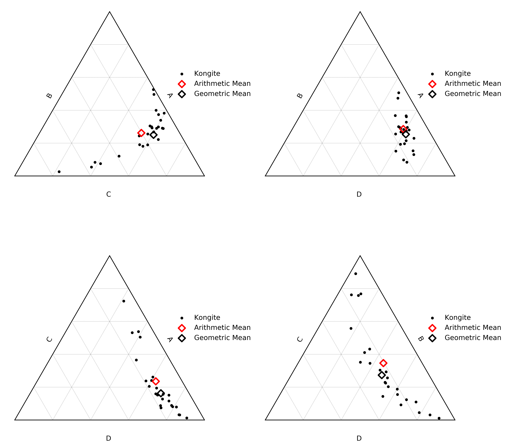

Compositional Data?
--------------------

.. note:: This page is currently incomplete and a work in progress. Submodule code
          overview can be found here :mod:`pyrolite.comp.codata`.

.. literalinclude:: ../../../../examples/comp/compositional_data.py
  :language: python
  :end-before: # %% Data

.. literalinclude:: ../../../../examples/comp/compositional_data.py
  :language: python
  :start-after: # %% Data
  :end-before: # %% Simple Means and covariance

For compositional data, everything is relative (thanks to the closure property), so we
tend to use ratios to express differences or changes between things. However,
if we make incorrect assumptions about the nature of our data, we can get some incorrect
answers:

.. literalinclude:: ../../../../examples/comp/compositional_data.py
  :language: python
  :start-after: # %% Simple Means and covariance
  :end-before: # %% Ratios of Poisson Data

These peculiarities result from incorrect assumptions regarding the distribution of the
data: ratios of compositional components are typically *lognormally* distributed, rather
than *normally* distributed, and the compositional components themselves commonly have
a `Poisson distribution <https://en.wikipedia.org/wiki/Poisson_distribution>`__ .
These distributions contrast significantly with the normal distribution at the core of
most statistical tests. We can compare distributions with similar means and variances
but different forms, and note that the normal distribution has one immediate
failure, in that it has non-zero probability density below 0, and we know that you can't
have negative atoms!

.. literalinclude:: ../../../../examples/comp/compositional_data.py
  :language: python
  :start-after: # %% Compositional data distributions
  :end-before: # %% Save Figure

The form of these distributions is a reflection of the fact that geochemical data
is at is core a measure of relative quantities of atoms. Quantities of atoms have
discrete distributions (i.e. you can have precisely 0, 1 or 6.02 x 10^23 atoms, but 1.23
atoms is not a sensible state of affairs); if you were to count them in a shiny
machine, the amount of atoms you might measure over a given period will have a Poisson
distribution. If you measure two components, the probability density distribution of the
ratio is well approximated by a lognormal distribution (note this doesn't consider
inherent covariance):

  .. literalinclude:: ../../../../examples/comp/compositional_data.py
    :language: python
    :start-after: # %% Ratios of Poisson Data
    :end-before: # %% Save Figure

  .. image:: ../../../_static/PoissonLognormals.png
    :width: 100%
    :align: center

Accounting for these inherent features of geochemical data will allow you to
accurately estimate means and variances, and from this enables the use of
standardised statistical measures - as long as you're log-transforming your data.
When performing multivariate analysis, use log-ratio transformations (including the
additive logratio :func:`~pyrolite.comp.codata.alr`, centred logratio
:func:`~pyrolite.comp.codata.clr` and isometric logratio
:func:`~pyrolite.comp.codata.ilr`):

.. literalinclude:: ../../../../examples/comp/compositional_data.py
  :language: python
  :start-after: # %% Higher Dimensional Visualisation of Mean
  :end-before: # %% Save Figure --

