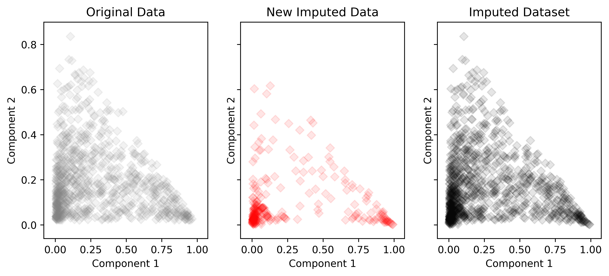

Compositional Data Imputation
-----------------------------

pyrolite includes the :func:`~pyrolite.comp.impute.EMCOMP` compositional missing data
imputation algorithm of Palarea-Albaladejo and Martín-Fernández (2008).
This algorithm imputes 'below-detection' data based on specified proportion thresholds:

.. literalinclude:: ../../../../examples/comp/EMCOMP.py
  :language: python
  :end-before: # %% Plot Data

.. literalinclude:: ../../../../examples/comp/EMCOMP.py
  :language: python
  :start-after: # %% Plot Data
  :end-before: # %% Save Figure

.. note:: Other features in this module are currently incomplete and a work in progress.
