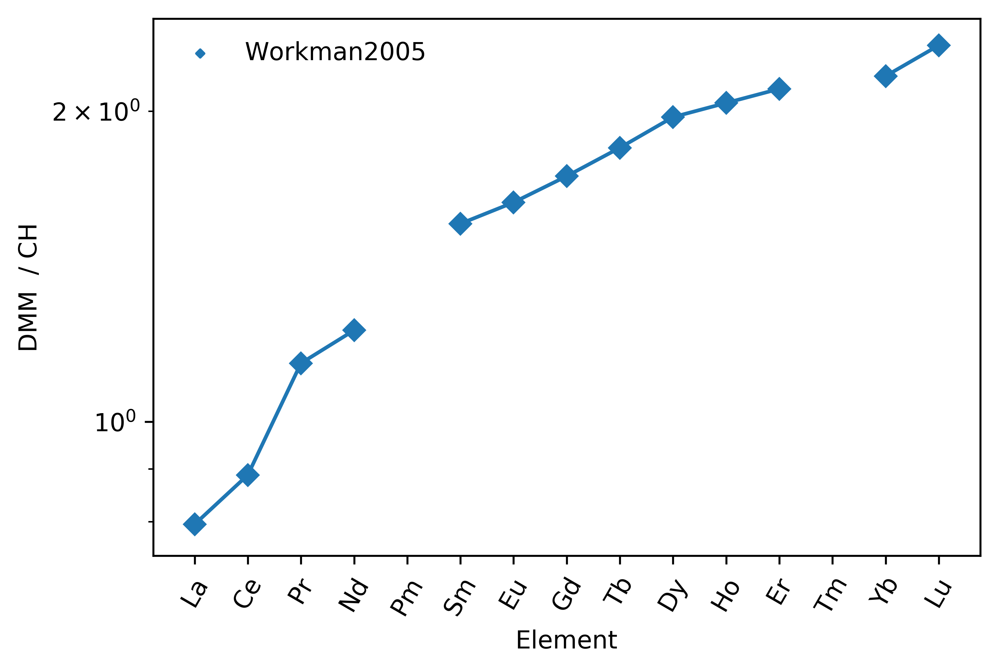

Normalisation
==============

A selection of reference compositions are included:

.. code-block:: python

  >>> CH = refcomp['Chondrite_PON']
  >>> PM = refcomp['PM_PON']
  >>> CH[REE()]
        value  unc_2sigma units
  var
  La    0.2414    0.014484   ppm
  Ce    0.6194    0.037164   ppm
  ...
  Tm   0.02609    0.001565   ppm
  Yb    0.1687    0.010122   ppm
  Lu   0.02503    0.001502   ppm

The `normalize` method can be used to normalise dataframes to a given reference (e.g. for spiderplots):

.. code-block:: python

  >>> refcomp = ReferenceCompositions()
  >>> CH = refcomp['Chondrite_PON']
  >>> DMM = refcomp['DMM_WH2005']

  >>> df = DMM.data.loc[REE(), ['value']]
  >>> CH.normalize(df).pyroplot.spider(label=f'{DMM.Reference}')

.. seealso::

  Examples:
    `Pandas Lambda Ln(REE) Function <../lambdas/pandaslambdas.html>`__,
    `Lambdas for Dimensional Reduction <../lambdas/lambdadimreduction.html>`__,
    `REE Radii Plot <../plotting/REE_radii_plot.html>`__

Currently available models include:

|refcomps|
