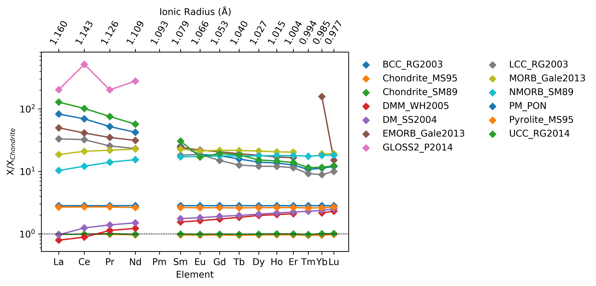

Normalization
==============

A selection of reference compositions are included in pyrolite, and can be easily
accessed with :func:`pyrolite.geochem.norm.get_reference_composition` (see the list
at the bottom of the page for a complete list):

.. literalinclude:: ../../../../_examples/geochem/normalization.py
  :language: python
  :end-before: # %% getref

.. literalinclude:: ../../../../_examples/geochem/normalization.py
  :language: python
  :start-after: # %% getref
  :end-before: # %% set units

To use the compositions with a specific set of units, you can change them with
:func:`pyrolite.geochem.norm.Composition.set_units`:

.. literalinclude:: ../../../../_examples/geochem/normalization.py
  :language: python
  :start-after: # %% set units
  :end-before: # %% REE plot

The :func:`~pyrolite.geochem.pyrochem.normalize_to` method can be used to
normalise DataFrames to a given reference (e.g. for spiderplots):

.. literalinclude:: ../../../../_examples/geochem/normalization.py
  :language: python
  :start-after: # %% REE plot
  :end-before: # %% save_figure

.. seealso::

  Examples:
    `Pandas Lambda Ln(REE) Function <../lambdas/pandaslambdas.html>`__,
    `Lambdas for Dimensional Reduction <../lambdas/lambdadimreduction.html>`__,
    `REE Radii Plot <../plotting/REE_radii_plot.html>`__

Currently available models include:

|refcomps|
