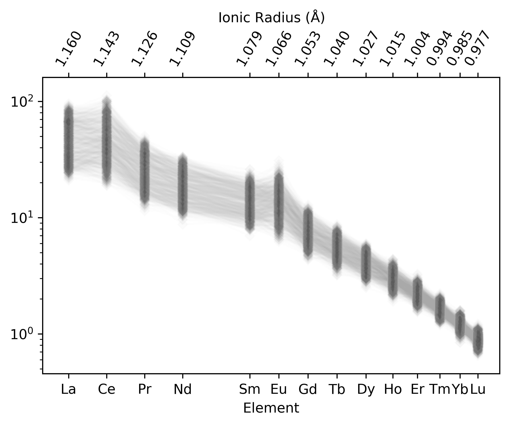
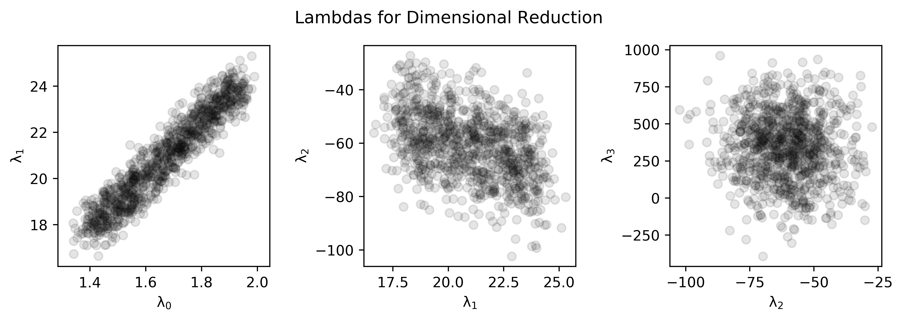

Dimensional Reduction
======================

.. seealso:: `Visualising Orthagonal Polynomials <visualisation.html>`__

Orthagonal polynomial decomposition can be used for dimensional reduction of smooth
function over an independent variable, producing an array of independent values
representing the relative weights for each order of component polynomial.

In geochemistry, the most applicable use case is for reduction Rare Earth Element (REE)
profiles. The REE are a collection of elements with broadly similar physicochemical
properties (the lanthanides), which vary with ionic radii. Given their similar behaviour
and typically smooth function of normalised abundance vs. ionic radii, the REE profiles
and their shapes can be effectively parameterised and dimensionally reduced (14 elements
summarised by 3-4 shape parameters).

Here we generate some example data, reduce these to lambda values, and plot the
resulting dimensionally reduced data.

.. literalinclude:: ../../../../examples/dimensional_reduction/lambdas.py
   :language: python
   :end-before: # %% Generate Some Example Data

.. literalinclude:: ../../../../examples/dimensional_reduction/lambdas.py
  :language: python
  :start-after: # %% Generate Some Example Data
  :end-before: # %% Plot Data

.. literalinclude:: ../../../../examples/dimensional_reduction/lambdas.py
  :language: python
  :start-after: # %% Reduce to Orthagonal Polynomials
  :end-before: # %% Plot the Results

.. literalinclude:: ../../../../examples/dimensional_reduction/lambdas.py
  :language: python
  :start-after: # %% Plot the Results
  :end-before: # %% End

