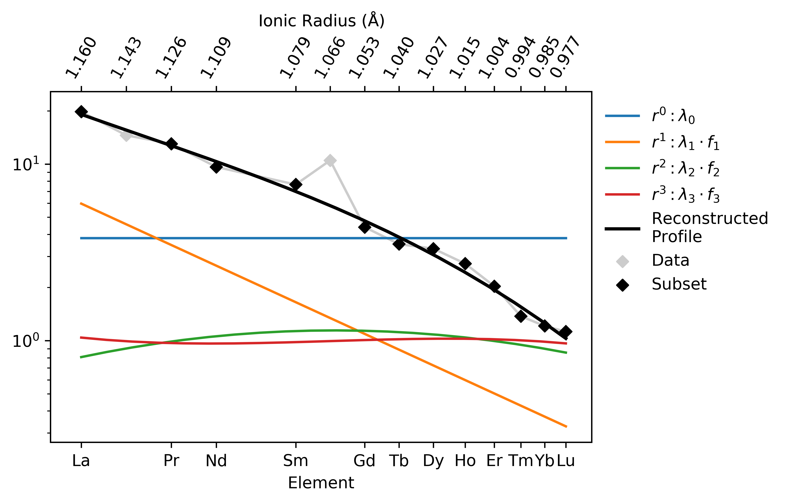

Visualising Orthogonal Polynomials
==================================

.. literalinclude:: ../../../../examples/lambdas/orthogonal_polynomials.py
   :language: python
   :end-before: # %% Generate Some Example Data

.. literalinclude:: ../../../../examples/lambdas/orthogonal_polynomials.py
   :language: python
   :start-after: # %% Generate Some Example Data
   :end-before: # %% Reduce to Orthogonal Polynomials

.. literalinclude:: ../../../../examples/lambdas/orthogonal_polynomials.py
   :language: python
   :start-after: # %% Reduce to Orthogonal Polynomials
   :end-before: # %% Plot the Results

.. literalinclude:: ../../../../examples/lambdas/orthogonal_polynomials.py
  :language: python
  :start-after: # %% Plot the Results
  :end-before: # %% End

For more on using orthogonal polynomials to describe geochemical pattern data, see:
O’Neill, H.S.C., 2016. The Smoothness and Shapes of Chondrite-normalized Rare Earth
Element Patterns in Basalts. J Petrology 57, 1463–1508.
`doi: 10.1093/petrology/egw047 <https://doi.org/10.1093/petrology/egw047>`__.

.. seealso::

  Examples:
    `Pandas Lambda Ln(REE) Function <pandaslambdas.html>`__,
    `Dimensional Reduction <lambdadimreduction.html>`__,
    `REE Radii Plot <../plotting/REE_v_radii.html>`__
