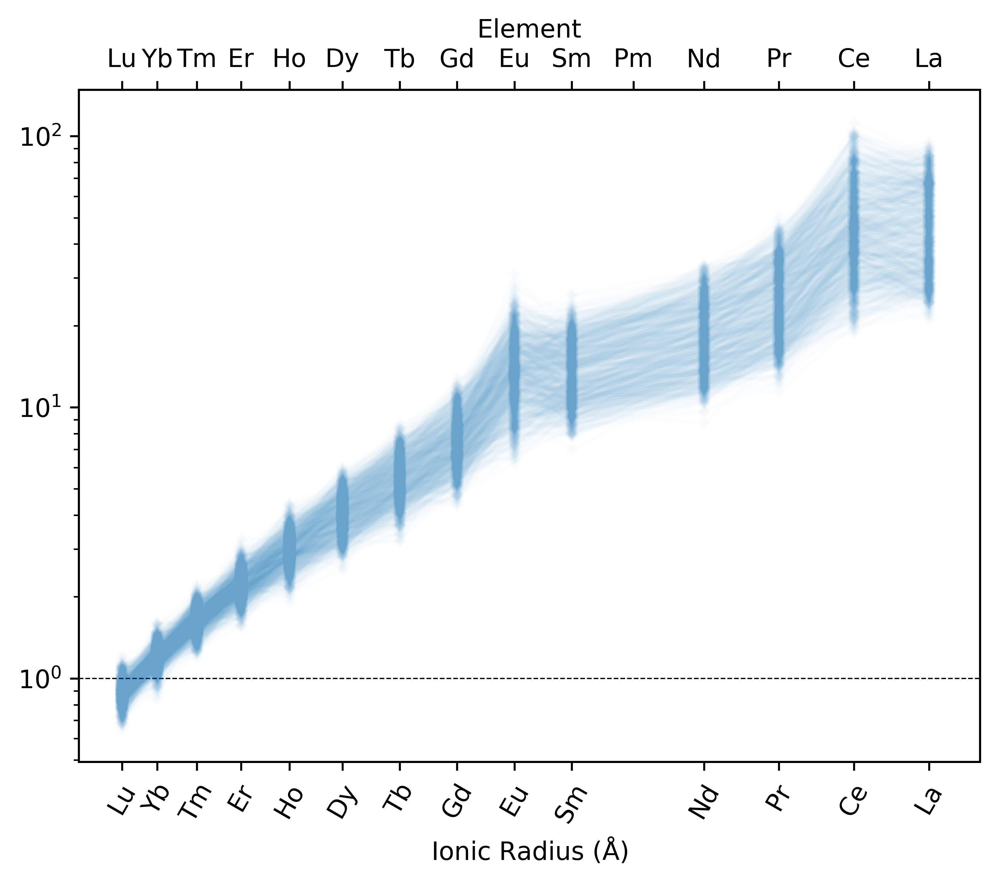
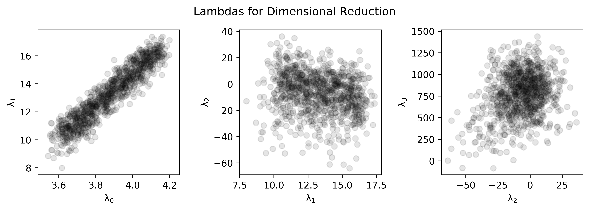

Pandas Lambdas from Ln(REE/Reference)
======================================

.. note:: This page is currently incomplete and a work in progress.

.. literalinclude:: ../../../../examples/pandas_interface/pandas_lnREE.py
   :language: python
   :end-before: # %% Generate Some Example Data

First we generate some example REE data, and plot this on a
:func:`pyrolite.plot.REE_v_radii`:

.. literalinclude:: ../../../../examples/pandas_interface/pandas_lnREE.py
  :language: python
  :start-after: # %% Generate Some Example Data
  :end-before: # %% Plot Data

The reduction to lambdas using the pandas interface is much simpler than using the
numpy-based utility functions (see :func:`pyrolite.util.math.lambdas`, `Dimensional Reduction <lambdadimreduction.html>`__):

.. literalinclude:: ../../../../examples/pandas_interface/pandas_lnREE.py
  :language: python
  :start-after: # %% Reduce to Orthogonal Polynomials
  :end-before: # %% Plot the Results

.. literalinclude:: ../../../../examples/pandas_interface/pandas_lnREE.py
  :language: python
  :start-after: # %% Plot the Results
  :end-before: # %% End

For more on using orthogonal polynomials to describe geochemical pattern data, see:
O’Neill, H.S.C., 2016. The Smoothness and Shapes of Chondrite-normalized Rare Earth
Element Patterns in Basalts. J Petrology 57, 1463–1508.
`doi: 10.1093/petrology/egw047 <https://doi.org/10.1093/petrology/egw047>`__.

.. seealso:: `Visualising Orthogonal Polynomials <lambdavis.html>`__,
             `Dimensional Reduction <lambdadimreduction.html>`__,
             `REE Radii Plot <../plotting/REE_v_radii.html>`__
