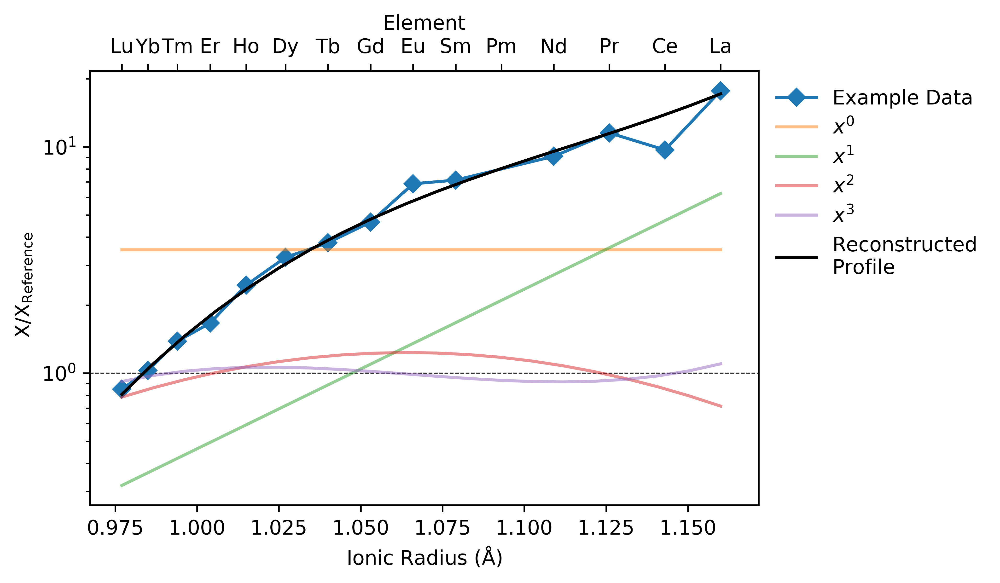

Visualising Orthagonal Polynomials
==================================

.. seealso:: `Dimensional Reduction <dimreduction.html>`__

.. literalinclude:: ../../../../examples/dimensional_reduction/orthagonal_polynomials.py
   :language: python
   :end-before: # %% Generate Some Example Data

.. literalinclude:: ../../../../examples/dimensional_reduction/orthagonal_polynomials.py
   :language: python
   :start-after: # %% Reduce to Orthagonal Polynomials
   :end-before: # %% Plot the Results

.. literalinclude:: ../../../../examples/dimensional_reduction/orthagonal_polynomials.py
  :language: python
  :start-after: # %% Plot the Results
  :end-before: # %% End

