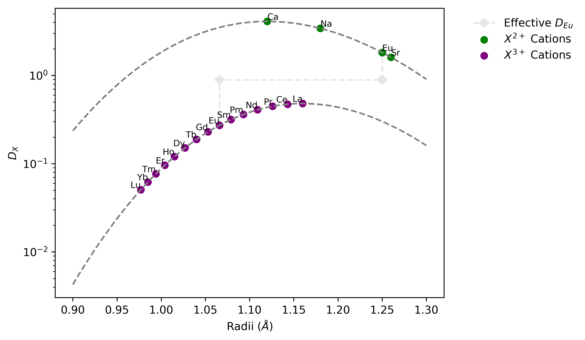

Lattice Strain Calculations
------------------------------

.. note::

    This example follows that given during a Institute of Advanced Studies Masterclass
    with Jon Blundy at the University of Western Australia on the 29\ :sup:`th` April
    2019, and is used here with permission.

Pyrolite includes a function for calculating relative lattice strain [#ref_1]_, which
together with the tables of Shannon ionic radii and Young's modulus approximations for
silicate and oxide cationic sites enable relatively simple calculation of ionic
partitioning in common rock forming minerals.

This example below uses previously characterised calcium and sodium partition
coefficients between plagioclase (:math:`CaAl_2Si_2O_8 - NaAlSi_3O8`) and silicate melt
to estimate partitioning for other cations based on their ionic radii.

A model parameterised using sodium and calcium partition coefficients [#ref_2]_ is then
used to estimate the partitioning for lanthanum into the trivalent site (largely
occupied by :math:`Al^{3+}`), and extended to other trivalent cations (here, the Rare
Earth Elements). The final section of the example highlights the mechanism which
generates plagioclase's hallmark 'europium anomaly', and the effects of variable
europium oxidation state on bulk europium partitioning.

.. literalinclude:: ../../../../examples/mineral/lattice.py
   :language: python
   :end-before: # %% config

First, we need to define some of the necessary parameters including temperature, the Young's
moduli for the :math:`X^{2+}` and :math:`X^{3+}` sites in plagioclase (:math:`E_2`,
:math:`E_3`), and some reference partition coefficients and radii for calcium and
sodium:

.. literalinclude:: ../../../../examples/mineral/lattice.py
   :language: python
   :start-after: # %% config
   :end-before: # %% 2+ cations

We can calculate and plot the partitioning of :math:`X^{2+}` cations relative to
:math:`Ca^{2+}` at a given temperature using their radii and the lattice strain function:

.. literalinclude:: ../../../../examples/mineral/lattice.py
   :language: python
   :start-after: # %% 2+ cations
   :end-before: # %% Calculate D(La)

When it comes to estimating the partitioning of :math:`X^{3+}` cations, we'll need a reference
point - here we'll use :math:`D_{La}` to calculate relative partitioning of the other
Rare Earth Elements, although you may have noticed it is not defined above.
Through a handy relationship, we can estimate :math:`D_{La}`
based on the easier measured :math:`D_{Ca}`, :math:`D_{Na}` and temperature [#ref_2]_:

.. literalinclude:: ../../../../examples/mineral/lattice.py
  :language: python
  :start-after: # %% Calculate D(La)
  :end-before: # %% 3+ cations

Now :math:`D_{La}` is defined, we can use it as a reference for the other REE:

.. literalinclude:: ../../../../examples/mineral/lattice.py
  :language: python
  :start-after: # %% 3+ cations
  :end-before: # %% Effective europium anomaly

As europium is commonly present as a mixture of both :math:`Eu^{2+}`
and :math:`Eu^{3+}`, the effective partitioning of Eu will be intermediate
between that of :math:`D_{Eu^{2+}}`and :math:`D_{Eu^{3+}}`. Using a 60:40 mixture
of :math:`Eu^{3+}` : :math:`Eu^{2+}` as an example, this effective partition
coefficient can be calculated:

.. literalinclude:: ../../../../examples/mineral/lattice.py
  :language: python
  :start-after: # %% Effective europium anomaly
  :end-before: # %% save figure

.. [#ref_1] Blundy, J., Wood, B., 1994. Prediction of crystal–melt partition coefficients
             from elastic moduli. Nature 372, 452. https://doi.org/10.1038/372452A0

.. [#ref_2] Dohmen, R., Blundy, J., 2014. A predictive thermodynamic model for element partitioning
            between plagioclase and melt as a function of pressure, temperature and composition.
            American Journal of Science 314, 1319–1372. https://doi.org/10.2475/09.2014.04

.. seealso::

  Examples:
    `Shannon Radii <../indexes/shannon.html>`__,
    `REE Radii Plot <../plotting/REE_v_radii.html>`__

  Functions:
    :func:`~pyrolite.mineral.lattice.strain_coefficient`,
    :func:`~pyrolite.mineral.lattice.youngs_modulus_approximation`,
    :func:`~pyrolite.geochem.get_ionic_radii`
