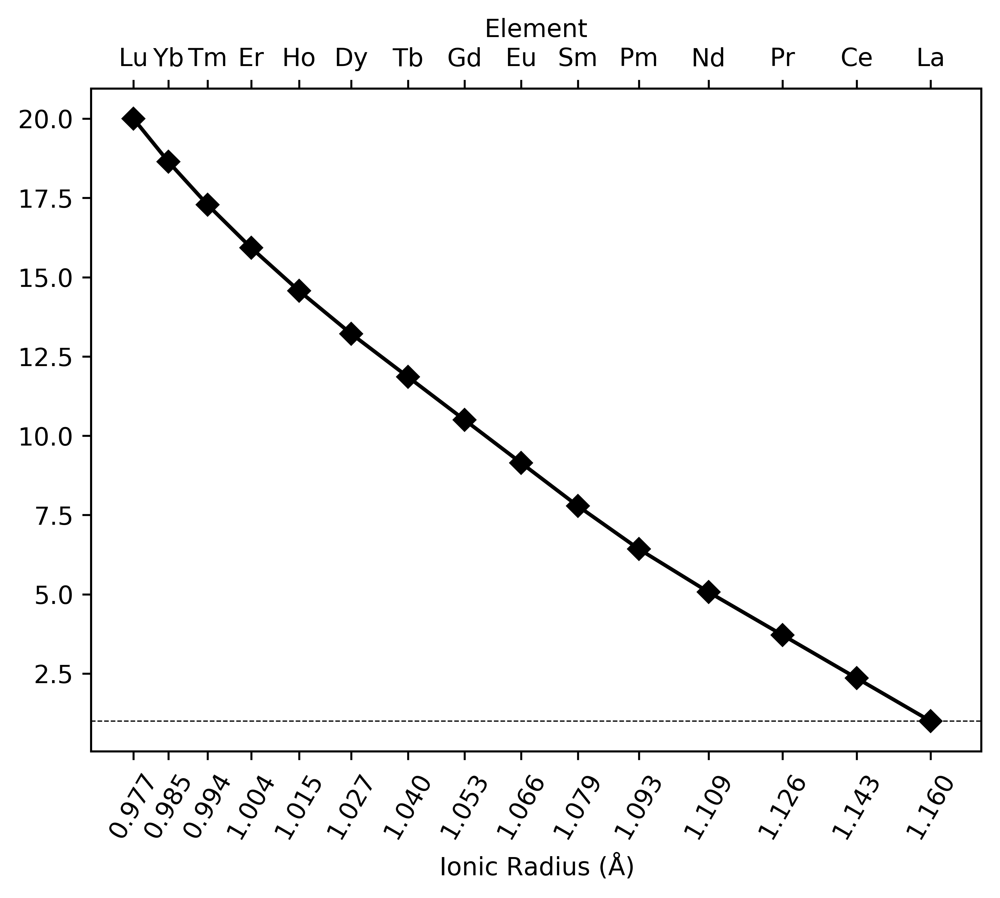
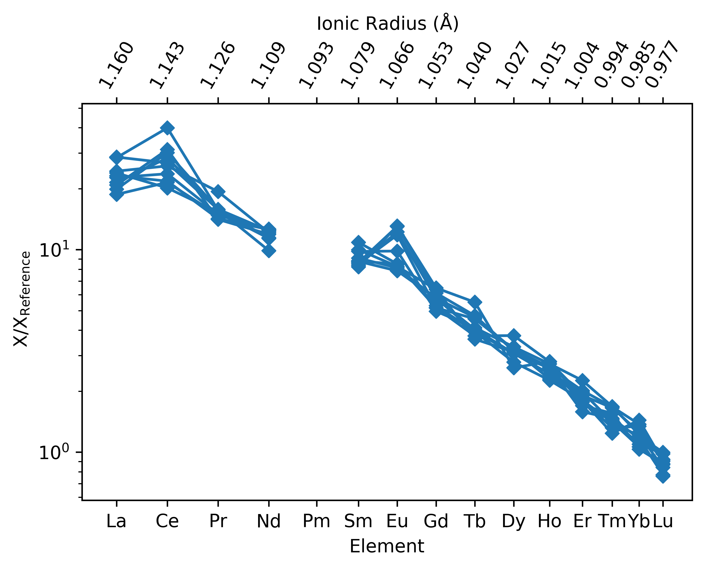
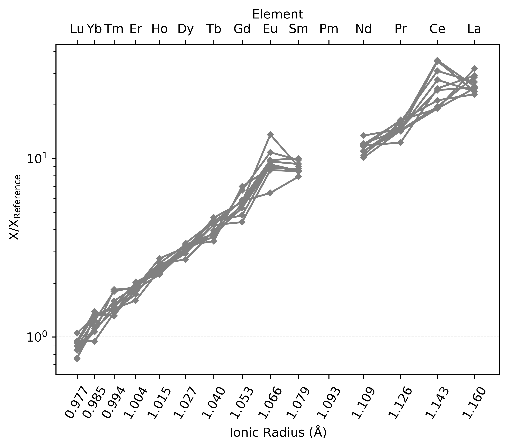
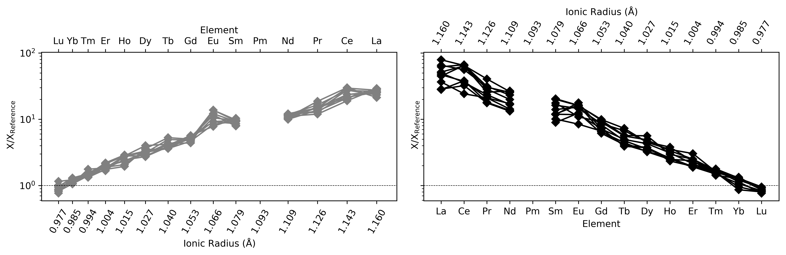

REE Radii Plots
============================

.. literalinclude:: ../../../../examples/plotting/REE_v_radii.py
   :language: python
   :end-before: # %% Minimal Example

.. literalinclude:: ../../../../examples/plotting/REE_v_radii.py
   :language: python
   :start-after: # %% Minimal Example
   :end-before: # %% Save Figure

.. literalinclude:: ../../../../examples/plotting/REE_v_radii.py
   :language: python
   :start-after: # %% Generate Some Example Data
   :end-before: # %% Data Specified

.. literalinclude:: ../../../../examples/plotting/REE_v_radii.py
   :language: python
   :start-after: # %% Data Specified
   :end-before: # %% Save Figure

.. literalinclude:: ../../../../examples/plotting/REE_v_radii.py
   :language: python
   :start-after: # %% Fill Plot
   :end-before: # %% Save Figure

.. literalinclude:: ../../../../examples/plotting/REE_v_radii.py
   :language: python
   :start-after: # %% Specify External Axis
   :end-before: # %% Save Figure

.. seealso:: `Visualising Orthogonal Polynomials <../lambdas/lambdavis.html>`__,
             `Dimensional Reduction <../lambdas/lambdadimreduction.html>`__,
             `Spider Density Diagrams <conditionaldensity.html>`__,
