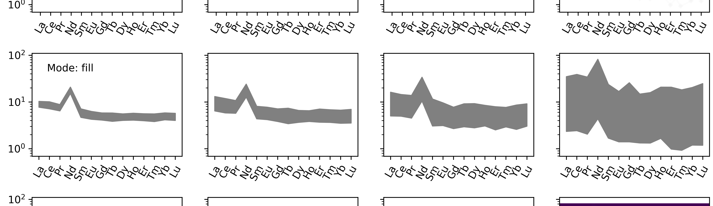
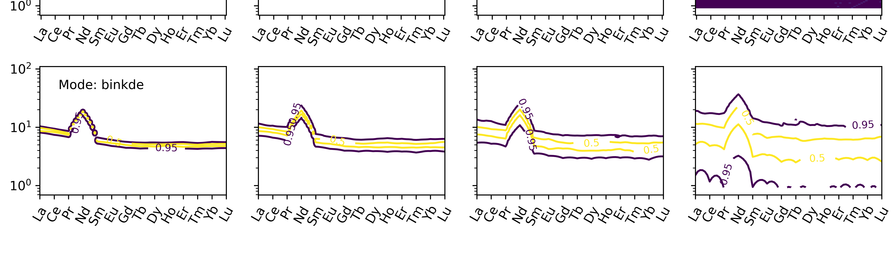
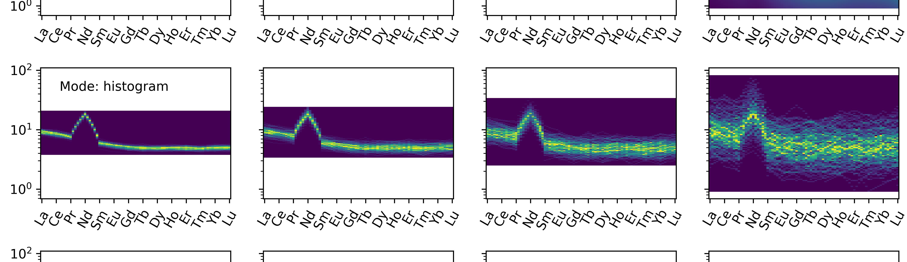
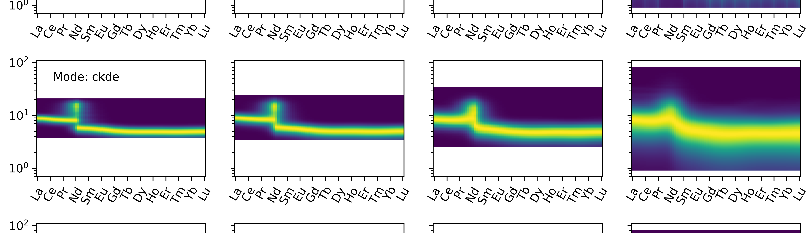

Conditional Density Spiderplots
==================================

The spiderplot can be extended to provide visualisations of ranges and density via the
various modes:

.. literalinclude:: ../../../../examples/plotting/conditionalspider.py
   :language: python

.. image:: ../../../_static/spider_mode_plot.png
   :width: 100%
   :align: center

.. image:: ../../../_static/spider_mode_kde.png
  :width: 100%
  :align: center

.. seealso:: `Density Plots <density.html>`__,
             `Spiderplots <spider.html>`__
