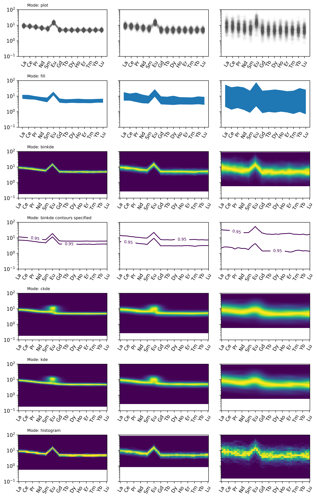

Conditional Density Spiderplots
==================================

The spiderplot can be extended to provide visualisations of ranges and density via the
various modes:

.. literalinclude:: ../../../../examples/plotting/conditionalspider.py
   :language: python
   :end-before: # %% save figure

.. seealso:: `Density Plots <density.html>`__,
             `Spiderplots <spider.html>`__
