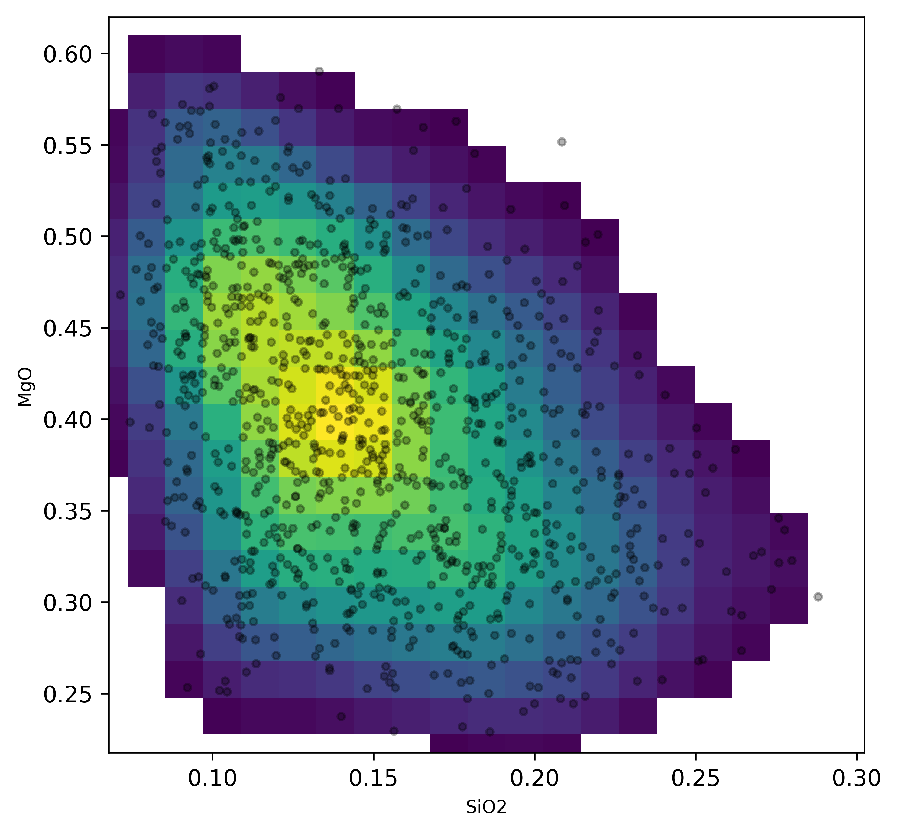
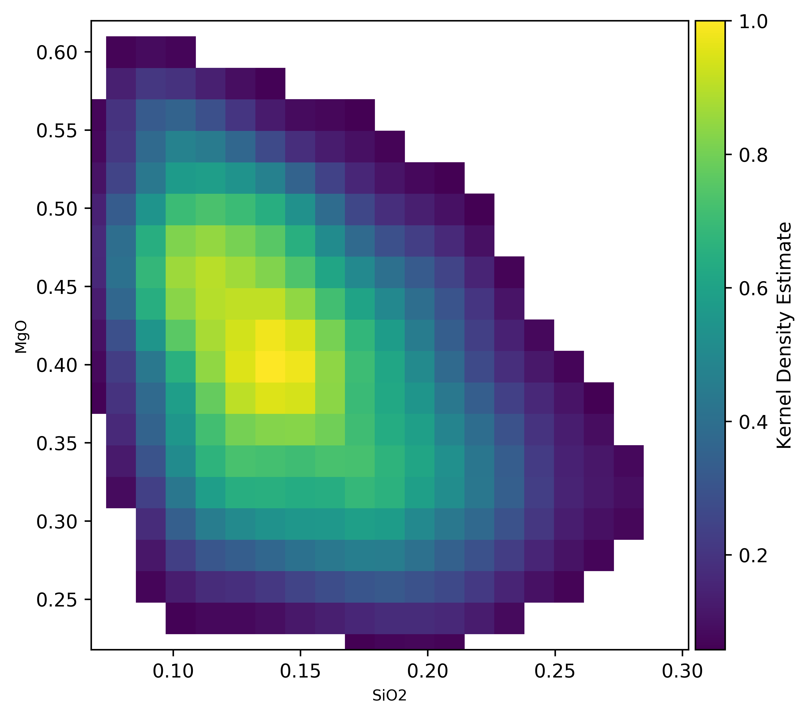
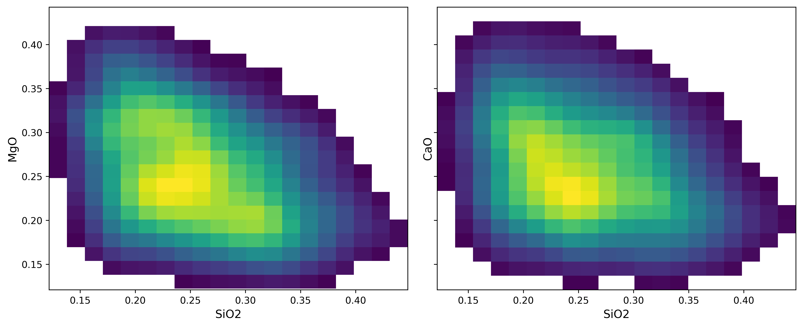
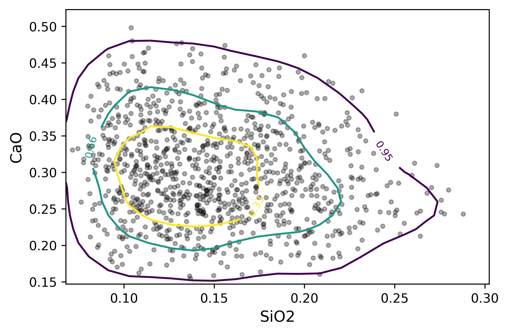
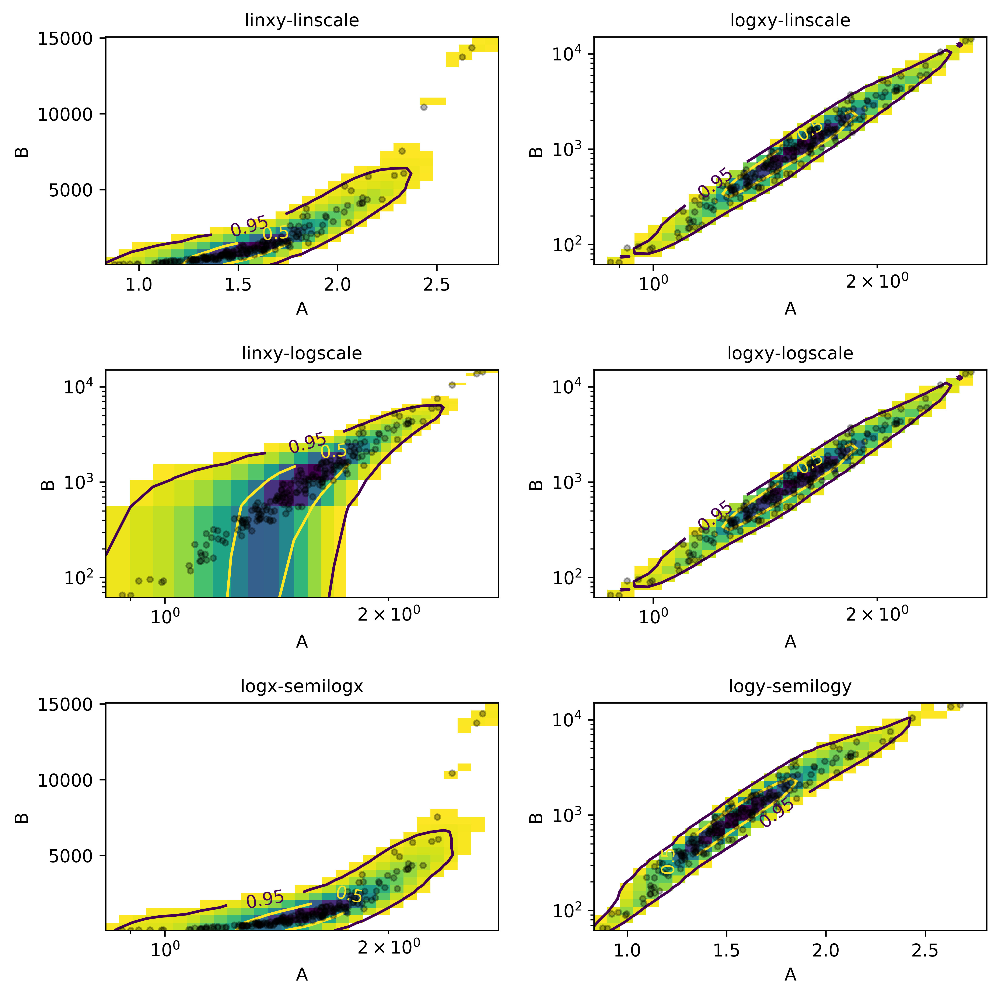
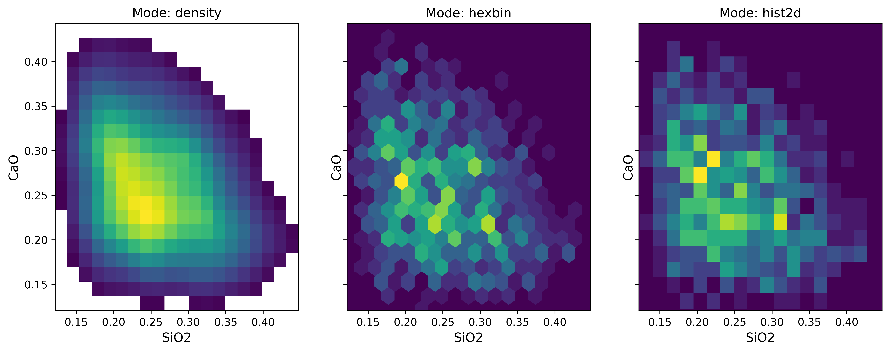
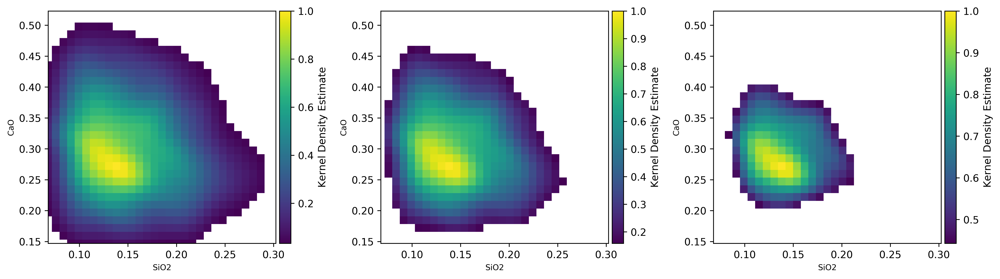
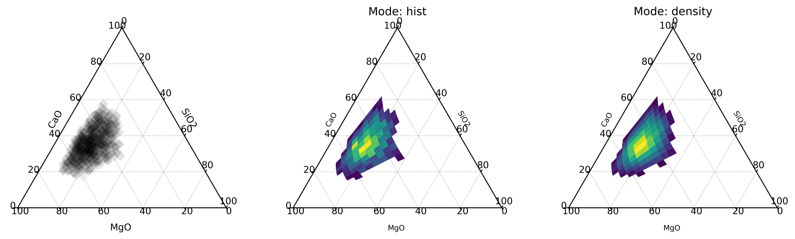

Density and Contour Plots
==================================

While individual point data are useful, we commonly want to understand the
the distribution of our data within a particular subspace, and compare that
to a reference or other dataset. Pyrolite includes a few functions for
visualising data density, most based on Gaussian kernel density estimation
and evaluation over a grid. The below examples highlight some of the currently
implemented features.

.. literalinclude:: ../../../../_examples/plotting/density.py
   :language: python
   :end-before: # %% Minimal Example

A minimal density plot can be constructed as follows:

.. literalinclude:: ../../../../_examples/plotting/density.py
   :language: python
   :start-after: # %% Minimal Example
   :end-before: # %% Save Figure

A colorbar linked to the KDE estimate colormap can be added using the `colorbar`
boolean switch:

.. literalinclude:: ../../../../_examples/plotting/density.py
   :language: python
   :start-after: # %% Colorbar
   :end-before: # %% Save Figure

`density` by default will create a new axis, but can also be plotted over an
existing axis for more control:

.. literalinclude:: ../../../../_examples/plotting/density.py
   :language: python
   :start-after: # %% Specify External Axis
   :end-before: # %% Save Figure

Contours are also easily created, which by default are percentile values:

.. literalinclude:: ../../../../_examples/plotting/density.py
   :language: python
   :start-after: # %% Percentiles
   :end-before: # %% Save Figure

Geochemical data is commonly log-normally distributed and is best analysed
and visualised after log-transformation. The density estimation can be conducted
over logspaced grids (individually for x and y axes using `logx` and `logy` boolean
switches). Notably, this makes both the KDE image and contours behave more naturally:

.. literalinclude:: ../../../../_examples/plotting/density.py
   :language: python
   :start-after: # %% Logspace
   :end-before: # %% Save Figure

There are two other implemented modes beyond the default `density`: `hist2d` and
`hexbin`, which parallel their equivalents in matplotlib.
Contouring is not enabled for these histogram methods.

.. literalinclude:: ../../../../_examples/plotting/density.py
   :language: python
   :start-after: # %% Modes
   :end-before: # %% Save Figure

For the ``density`` mode, a ``vmin`` parameter is used to choose the lower
threshold, and by default is the 99th percentile (``vmin=0.01``), but can be
adjusted. This is useful where there are a number of outliers, or where you wish to
reduce the overall complexity/colour intensity of a figure (also good for printing!).

.. literalinclude:: ../../../../_examples/plotting/density.py
   :language: python
   :start-after: # %% Density Vmin
   :end-before: # %% Save Figure

Density plots can also be used for ternary diagrams, where more than two components
are specified:

.. literalinclude:: ../../../../_examples/plotting/density.py
   :language: python
   :start-after: # %% Density Ternary
   :end-before: # %% Save Figure

.. note:: Using alpha with the ``density`` mode induces a known and old matplotlib bug,
          where the edges of bins within a ``pcolormesh`` image (used for plotting the
          KDE estimate) are over-emphasized, giving a gridded look.

.. seealso:: `Ternary Plots <../plotting/ternary.html>`__,
             `Spider Density Diagrams <conditionaldensity.html>`__,
             `Heatmapped Scatter Plots <heatscatter.html>`__,
