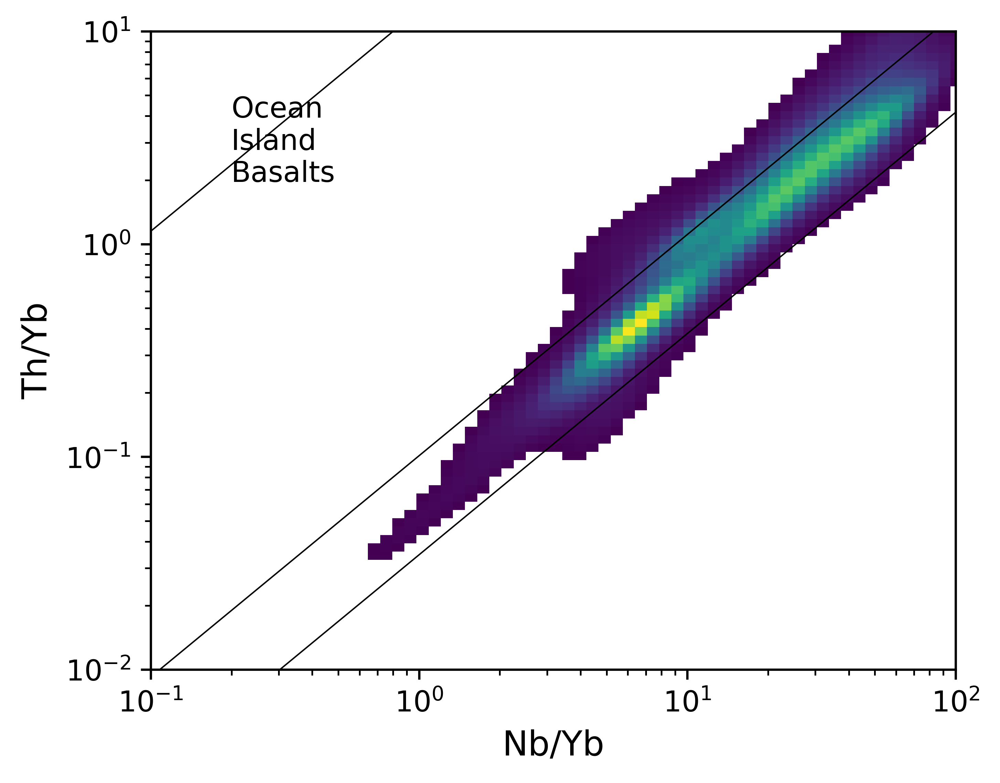

Density Plots
==============

Log-spaced data density plots can be useful to visualise geochemical data density:

  from pyrolite.plot import densityplot
  # with a dataframe <df> containing columns Nb/Yb and Th/Yb
  densityplot(df, components=['Nb/Yb', 'Th/Yb'], bins=100, logspace=True)

Below is an example of ocean island basalt data
([GEOROC](http://georoc.mpch-mainz.gwdg.de/georoc/) compilation), plotted in a
'Pearce' discrimination diagram:

More on these discrimination diagrams: Pearce, J.A., 2008.
Geochemical fingerprinting of oceanic basalts with applications to ophiolite
classification and the search for Archean oceanic crust. Lithos 100, 14–48.
`doi: 10.1016/j.lithos.2007.06.016 <https://doi.org/10.1016/j.lithos.2007.06.016>`__,
