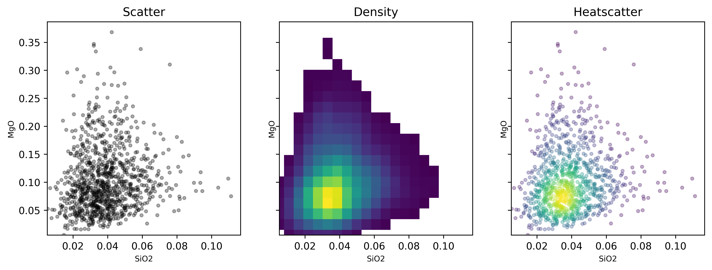
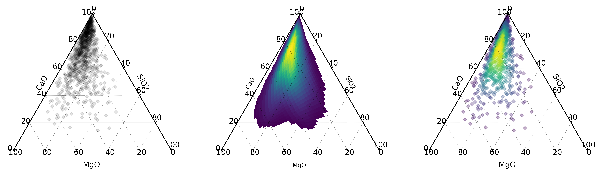

Heatscatter Plots
==================================

While :func:`~pyrolite.plot.pyroplot.density` plots are useful summary visualizations
for large datasets, scatterplots are more precise and retain all spatial information
(although they can get crowded).

A scatter plot where individual points are coloured by data density in some respects
represents the best of both worlds. A version inspired by similar existing
visualisations is implemented with :func:`~pyrolite.plot.pyroplot.heatscatter`.

.. literalinclude:: ../../../../examples/plotting/heatscatter.py
   :language: python
   :end-before: # %% Minimal Example

We can compare a minimal :func:`~pyrolite.plot.pyroplot.heatscatter` plot to other
visualisations for the same data:

.. literalinclude:: ../../../../examples/plotting/heatscatter.py
   :language: python
   :start-after: # %% Minimal Example
   :end-before: # %% Save Figure

We can use the same interface for ternary diagrams:

.. literalinclude:: ../../../../examples/plotting/heatscatter.py
   :language: python
   :start-after: # %% Density Ternary
   :end-before: # %% Save Figure

.. seealso:: `Ternary Plots <../plotting/ternary.html>`__,
             `Density Plots <../plotting/density.html>`__,
             `Spider Density Diagrams <conditionaldensity.html>`__
