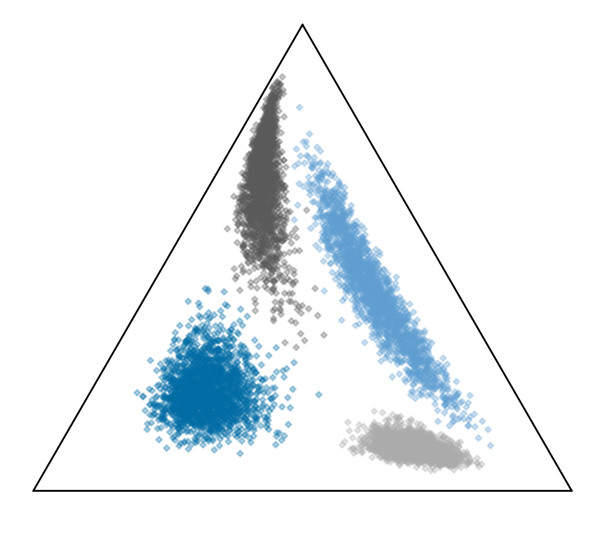
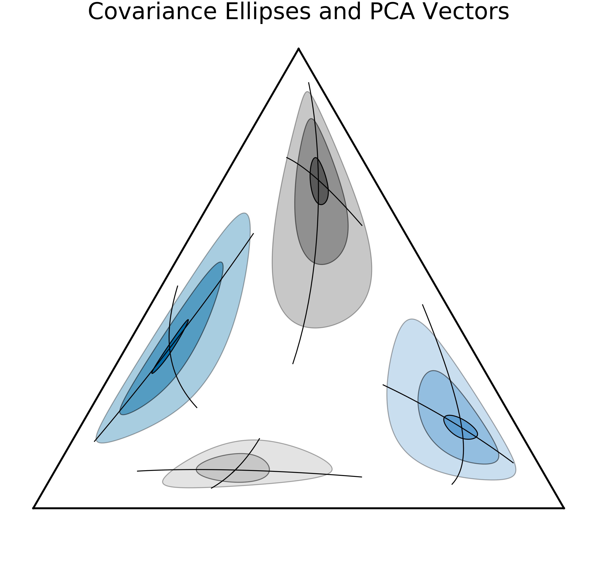
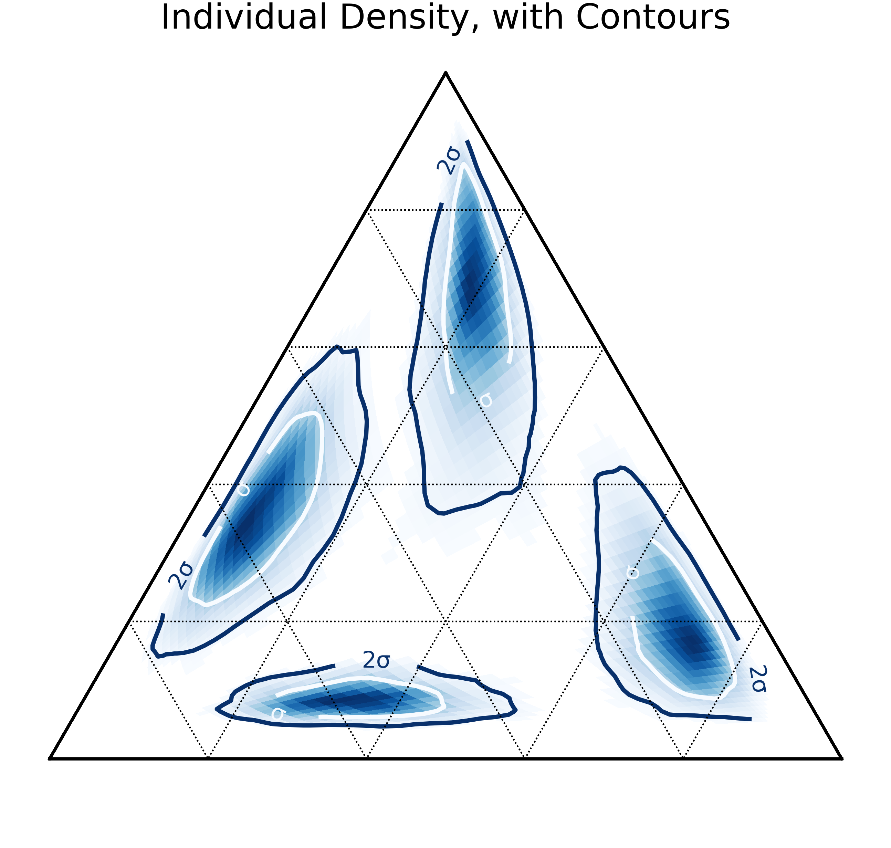
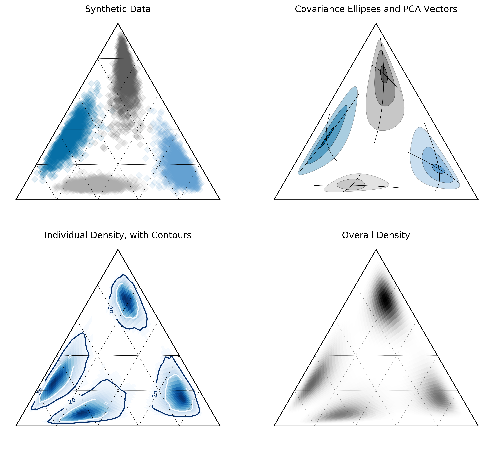

Making the Logo
==================================

Having some funky ellipses in a simplex inspired some interest when I put the logo
together for pyrolite, so I put together a cleaned-up example of how you can create
these kinds of plots for your own data. These examples illustrate different methods to
show distribution of (homogeneous, or near so) compositional data for exploratory
analysis.

.. literalinclude:: ../../../../examples/plotting/logo.py
   :language: python
   :end-before: # %% colors

First we choose some colors, create some log-distributed synthetic data. Here I've
generated a synthetic dataset with four samples having means equidistant from the
log-space centre and with varying covariance. This should illustrate the spatial
warping of the simplex nicely. Additionally, I chose a log-transform here to go
from and to compositional space (:class:`~pyrolite.util.skl.ILRTransform`, which uses
the isometric log-ratio functions
:func:`~pyrolite.comp.codata.ilr` and :func:`~pyrolite.comp.codata.ilr`). Choosing
another transform will change the distortion observed in the simplex slightly.
This synthetic dataset is added into a :class:`~pandas.DataFrame` for convenient access
to plotting functions via the pandas API defined in :class:`pyrolite.plot.pyroplot`.

.. literalinclude:: ../../../../examples/plotting/logo.py
   :language: python
   :start-after: # %% colors
   :end-before: # %% data and transforms

.. literalinclude:: ../../../../examples/plotting/logo.py
   :language: python
   :start-after: # %% data and transforms
   :end-before: # %% figure

.. literalinclude:: ../../../../examples/plotting/logo.py
   :language: python
   :start-after: # %% figure
   :end-before: # %% scatter

First, let's look at the synthetic data itself in the ternary space:

.. literalinclude:: ../../../../examples/plotting/logo.py
   :language: python
   :start-after: # %% scatter
   :end-before: # %% ellipses and vectors from PCA

We can take the mean and covariance in log-space to create covariance ellipses and
vectors using principal component analysis:

.. literalinclude:: ../../../../examples/plotting/logo.py
   :language: python
   :start-after: # %% ellipses and vectors from PCA
   :end-before: # %% individual density diagrams

We can also look at data density (here using kernel density estimation)
in log-space:

.. literalinclude:: ../../../../examples/plotting/logo.py
  :language: python
  :start-after: # %% overall density diagram
  :end-before: # %% axes cleanup

.. image:: ../../../_static/icon_density.png
  :width: 50%
  :align: center

We can also do this for individual samples, and estimate percentile contours:

.. literalinclude:: ../../../../examples/plotting/logo.py
   :language: python
   :start-after: # %% individual density diagrams
   :end-before: # %% overall density diagram

Typically, you'll want to do some axes clean-up, this is what's used for these figures:

.. literalinclude:: ../../../../examples/plotting/logo.py
  :language: python
  :start-after: # %% axes cleanup
  :end-before: # %% Save Figure

.. seealso:: `Ternary Plots <../plotting/ternary.html>`__,
             `Density Plots <../plotting/density.html>`__
