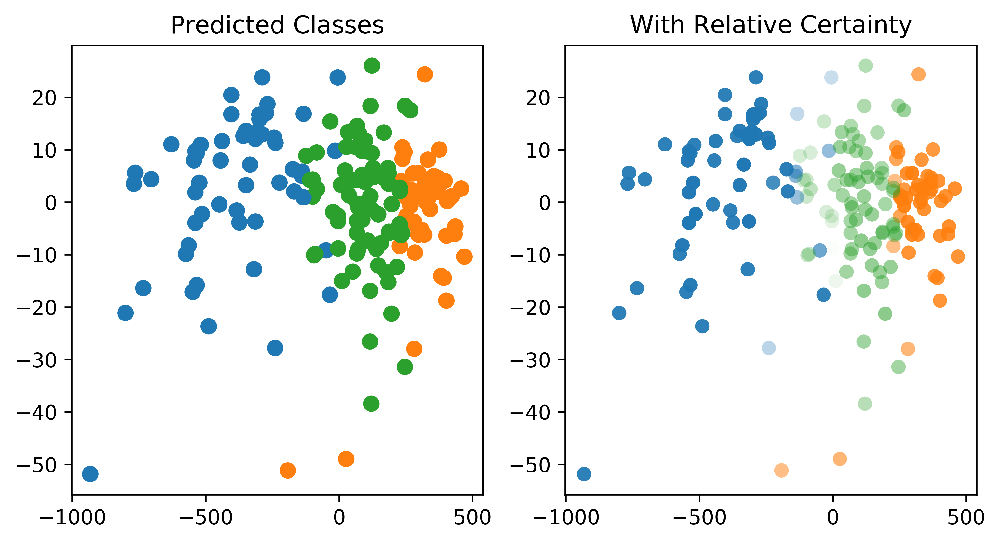

Using Manifolds for Visualisation
=================================

Visualisation of data which has high dimensionality is challenging, and one solution
is to provide visualisations in low-dimension representations of the space actually
spanned by the data. Here we provide an example of visualisation of classification
predictions and relative prediction certainty (using entropy across predicted
probability for each individual class) for a toy :mod:`sklearn` dataset.

.. literalinclude:: ../../../../_examples/plotting/manifold_uncertainty.py
   :language: python
   :end-before: %% Import sklearn digits dataset

.. literalinclude:: ../../../../_examples/plotting/manifold_uncertainty.py
   :language: python
   :start-after: # %% Import sklearn digits dataset
   :end-before: # %% Discard Dimensionality

.. literalinclude:: ../../../../_examples/plotting/manifold_uncertainty.py
  :language: python
  :start-after: # %% SVC Pipeline
  :end-before: # %% Plot

.. literalinclude:: ../../../../_examples/plotting/manifold_uncertainty.py
  :language: python
  :start-after: # %% Plot
  :end-before: # %% Save Figure

