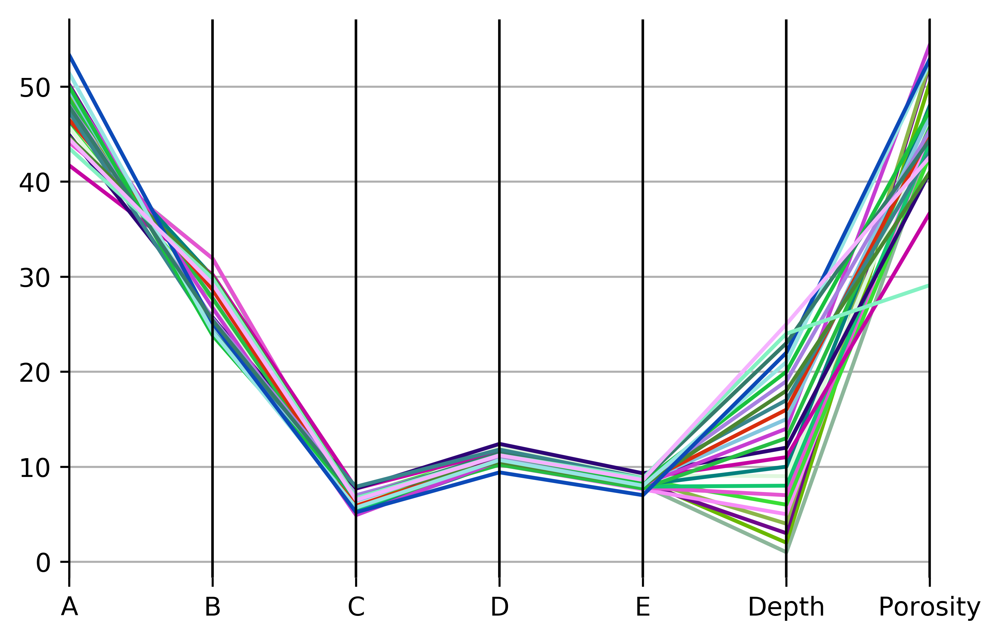
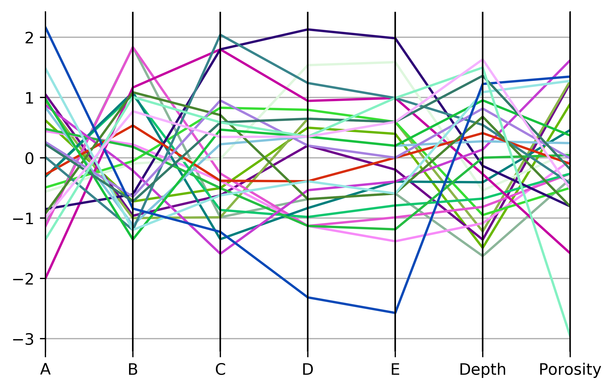
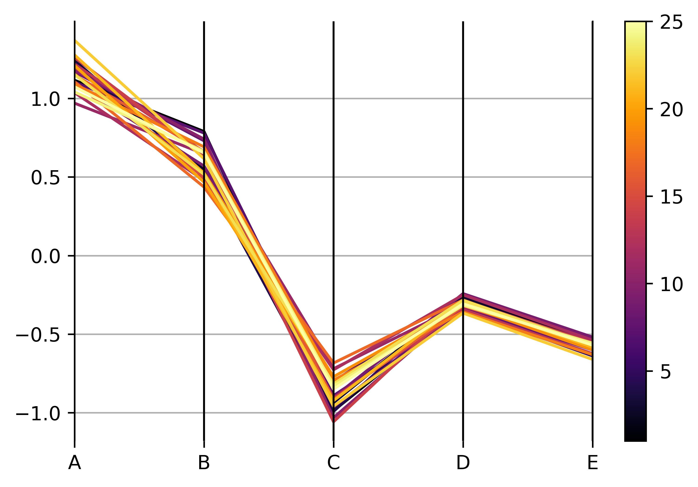
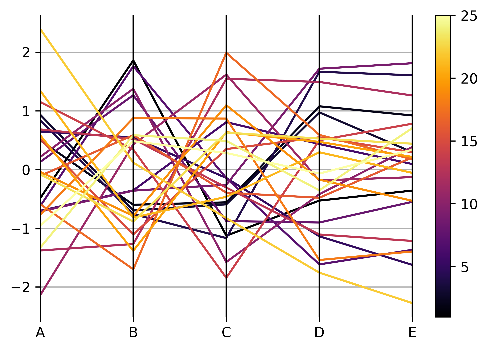

Parallel Coordinate Plots
============================

Parallel coordinate plots are one way to visualise data relationships and clusters in
higher dimensional data. pyrolite now includes an implementation of this which allows
a handy quick exploratory visualisation.

.. literalinclude:: ../../../../examples/plotting/parallel.py
   :language: python
   :end-before: # %% Data

.. literalinclude:: ../../../../examples/plotting/parallel.py
   :language: python
   :start-after: # %% Data
   :end-before: # %% Default

.. literalinclude:: ../../../../examples/plotting/parallel.py
   :language: python
   :start-after: # %% Default
   :end-before: # %% save

By rescaling this using the mean and standard deviation, we can account for scale
differences between variables:

.. literalinclude:: ../../../../examples/plotting/parallel.py
  :language: python
  :start-after: # %% Default Rescale
  :end-before: # %% save

We can also use a centred-log transform for compositional data to reduce the effects
of spurious correlation:

.. literalinclude:: ../../../../examples/plotting/parallel.py
  :language: python
  :start-after: # %% CLR
  :end-before: # %% save

Further, we can also rescale this if there remain significant scale differences (e.g.
majors and traces):

.. literalinclude:: ../../../../examples/plotting/parallel.py
  :language: python
  :start-after: # %% CLR Rescale
  :end-before: # %% save

.. note:: Feature suggested by `Justin Gosses <https://github.com/JustinGOSSES>`__.
