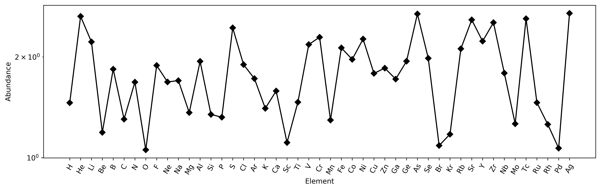
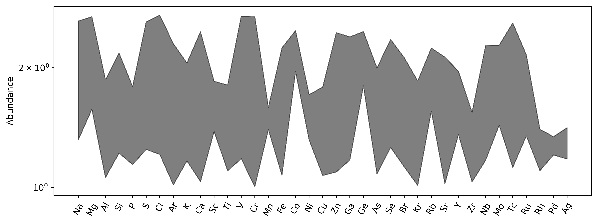
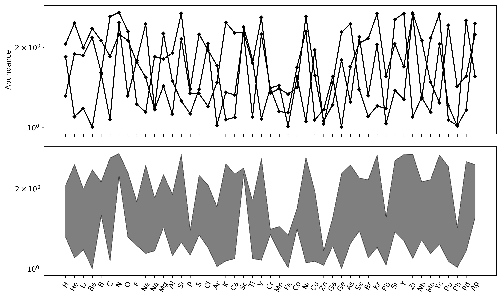
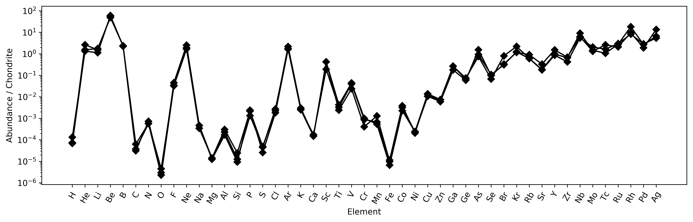

Spider Plots
==============

.. literalinclude:: ../../../../examples/plotting/spider.py
   :language: python
   :end-before: # %% Minimal Example

.. literalinclude:: ../../../../examples/plotting/spider.py
   :language: python
   :start-after: # %% Minimal Example
   :end-before: # %% Save Figure

.. literalinclude:: ../../../../examples/plotting/spider.py
   :language: python
   :start-after: # %% Fill Plot
   :end-before: # %% Save Figure

.. literalinclude:: ../../../../examples/plotting/spider.py
   :language: python
   :start-after: # %% Specify External Axis
   :end-before: # %% Save Figure

.. literalinclude:: ../../../../examples/plotting/spider.py
   :language: python
   :start-after: # %% Normalised Data
   :end-before: # %% Save Figure

.. seealso:: `Spider Density Diagrams <conditionaldensity.html>`__,
             `Normalisation <../geochem/normalization.html>`__,
             `REE Radii Plot <REE_v_radii.html>`__,
             `REE Dimensional Reduction <../lambdas/lambdadimreduction.html>`__
