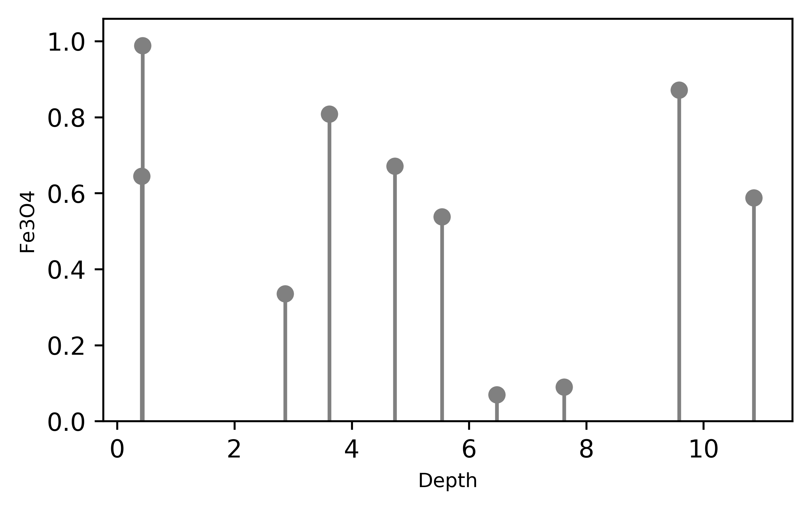
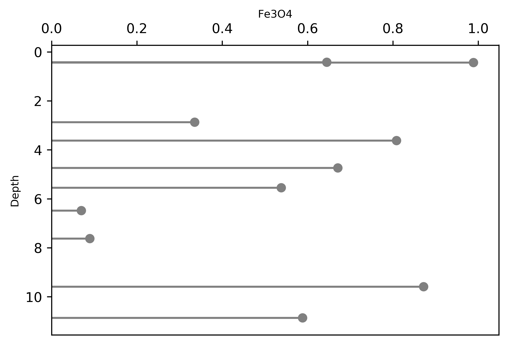

Stem Plots
============

Stem plots are commonly used to visualise discrete distributions of data,
and are useful to highlight discrete observations where the precision of values along
one axis is high (e.g. an independent spatial measure like depth) and the other is less
so (such that the sampling frequency along this axis is important, which is not
emphasised by a scatter plot).

.. literalinclude:: ../../../../examples/plotting/stem.py
   :language: python
   :end-before: # %% Minimal Example

A minimal stem plot can be constructed as follows:

.. literalinclude:: ../../../../examples/plotting/stem.py
   :language: python
   :start-after: # %% Minimal Example
   :end-before: # %% Save Figure

Stem plots can also be used in a vertical orientation, such as for visualising
discrete observations down a drill hole:

.. literalinclude:: ../../../../examples/plotting/stem.py
   :language: python
   :start-after: # %% Orientation
   :end-before: # %% Save Figure

