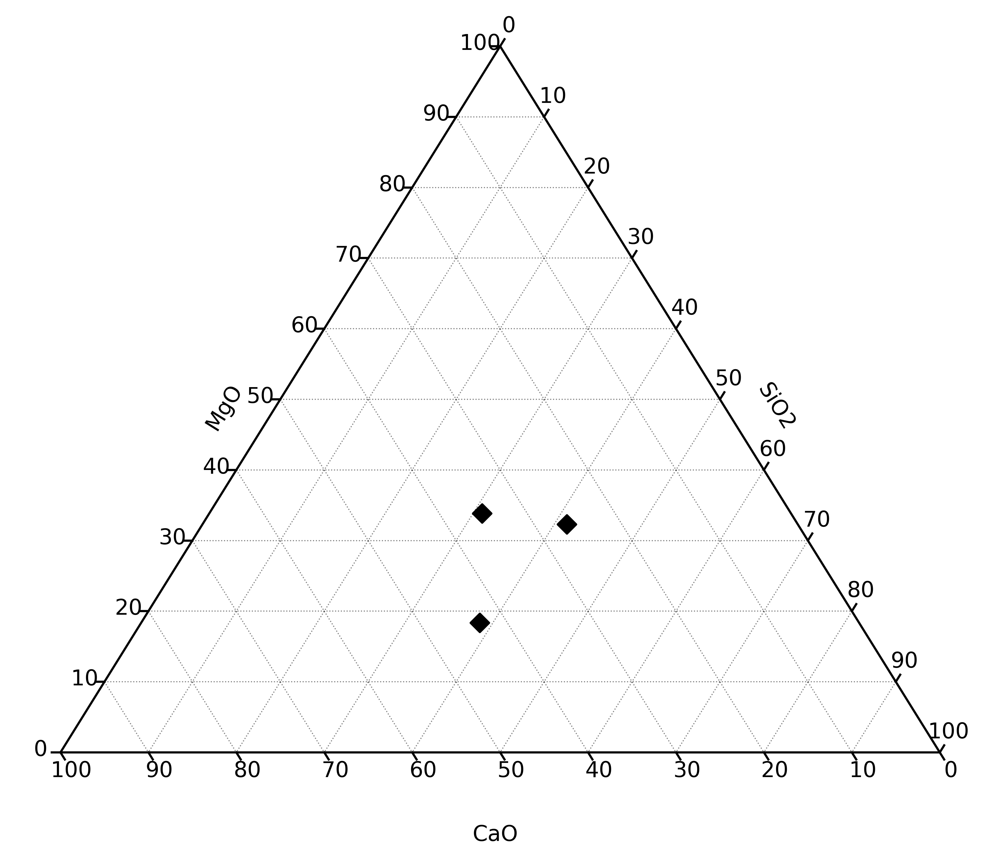
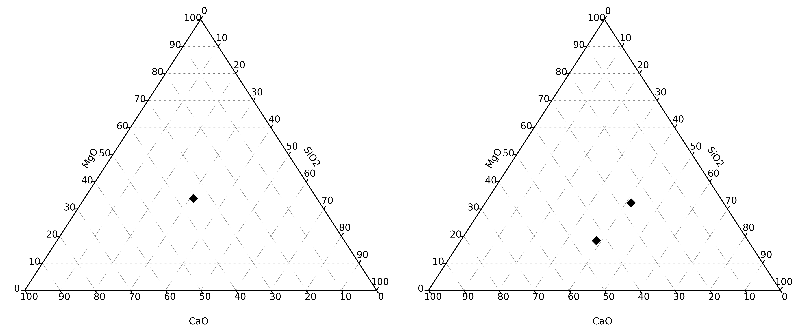

Ternary Plots
=============

Note that this is a thin wrapper around Marc Harper's
`python-ternary <https://github.com/marcharper/python-ternary>`__ package. This may
change in the near future as needs change, but works well for scatter plots.

.. literalinclude:: ../../../../examples/plotting/tern.py
   :language: python
   :end-before: # %% Minimal Example

.. literalinclude:: ../../../../examples/plotting/tern.py
   :language: python
   :start-after: # %% Minimal Example
   :end-before: # %% Save Figure

.. literalinclude:: ../../../../examples/plotting/tern.py
   :language: python
   :start-after: # %% Specify External Axis
   :end-before: # %% Save Figure

.. seealso:: `Density Plots <../plotting/density.html>`__,
             `Heatmapped Scatter Plots <heatscatter.html>`__
