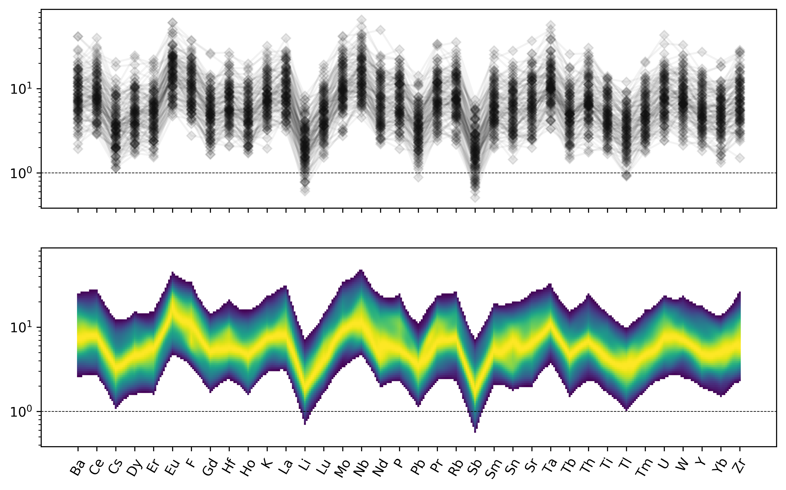

<!-- 250-1000 words -->

# Summary

``pyrolite`` is a Python package for working with multivariate geochemical data. Geochemical data is compositional (i.e. sums to 100%), and as such requires non-standard statistical treatment [@Aitchison1984]. Further, the need to visualise geochemical data has historically limited the use of multivariate measures in geochemical research. While effectively visualising geochemical data remains a challenge, ``pyrolite`` enables users to make better use of their data dimensionality, calculate more accurate statistical measures, and provides access to visualisation methods useful for working with steadily growing volumes of geochemical data. ``pyrolite`` was built with the aim of contributing to more robust, efficient and reproducible data-driven geochemical research.

``pyrolite`` provides tools for munging, transforming and visualising geochemical data from common tabular formats. It enables you to recalculate and rescale whole-rock and mineral compositions, perform compositional statistics and create appropriate visualisations and also includes numerous specific utilities (e.g. a geological timescale). These tools also provide a foundation for preparing data for subseqent machine learning applications using ``scikit-learn`` [@Pedregosa2011].

A variety of standard diagram methods (e.g. ternary, spider, and data-density diagrams), templated diagrams (e.g. the Total-Alkali Silica diagram [@LeBas1992] and Pearce diagrams [@Pearce2008]) and novel geochemical visualisation methods are available. ``pyrolite`` also includes reference datasets of compositional reservoirs (e.g. CI-Chondrite, Bulk Silicate Earth, Mid-Ocean Ridge Basalt) and a number of rock-forming mineral endmembers. The first is included to enable normalisation of composition to investigate relative geochemical patterns, and the second to facilitate mineral endmember recalculation and normative calculations. ``pyrolite`` also includes some specific methods to model geochemical patterns, such as the lattice strain model for trace element partitioning of @Blundy2003, the Sulfur Content at Sulfur Saturation (SCSS) model of @Li2009, and orthogonal polynomial decomposition for parameterising Rare Earth Element patterns of @ONeill2016. Extensions beyond the core functionality are also being developed, including ``pyrolite-meltsutil`` which provides utilities for working with ``alphaMELTS`` [@Smith2005] and it's outputs, and is targeted towards performing large numbers of related melting and fractionation experiments.

The ``pyrolite`` API follows and builds upon a number of existing packages, and where relevant exposes their API, particularly for ``matplotlib`` [@Hunter2007] and ``pandas`` [@McKinney2010]. This enables geochemists new to Python to hit the ground running, and encourages development of transferable digital skills.

# Acknowledgements

# References
